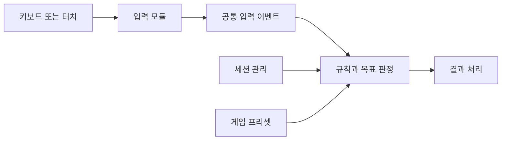

# 미니게임의 입력, 규칙, 실행 흐름 분리

## Issue

입력 방식이 다른 미니게임마다 준비, 시작, 시간 제한, 종료 처리를 각각 만들면 같은 수정이 여러 구현에 반복됩니다. PC 키보드와 모바일 터치의 차이까지 개별 게임에 섞이면 게임 규칙과 플랫폼별 입력 처리를 함께 수정해야 합니다.

## Solution

입력 모듈이 수집한 동작을 공통 이벤트로 전달하고, 게임 규칙은 별도 실행 계층에서 판단하도록 했습니다. 세션 관리자는 사용자와 실행 상태, 준비 시간 제한, 종료 흐름을 관리하고, UI 라우터는 실행 상황에 맞는 화면 연결을 맡도록 했습니다.

현재 리팩터링에서는 입력 규칙, 목표, 단계별 시간과 결과 처리를 분리했습니다. 게임 프리셋은 이러한 규칙을 연결하는 데이터로 정의하도록 했습니다.

## Result

일반 이벤트와 연출에서 공통 미니게임 실행 흐름을 사용하도록 했고, PC와 모바일에서 게임 입력과 종료 동작을 확인했습니다. 입력 방식에 따른 처리를 분리하여 준비와 종료 정책을 개별 게임마다 중복 작성하지 않도록 했습니다.

클라이언트에서 판정하는 입력과 서버가 확인하는 입력은 구분됩니다. 모든 입력 결과를 서버에서 독립 재계산하는 부정행위 방지 구조는 아닙니다. 또한 현재 등록된 프리셋과 규칙 구조를 최초 출시 시점부터 모두 사용했다고 표현하지 않습니다.

## 코드 읽는 순서

1. [MiniGameTable: 게임 정의](../Source/RootDesk/MyDesk/MiniGame/Data/MiniGameTable.mlua)
2. [MiniGameManager: 시작과 종료](../Source/RootDesk/MyDesk/MiniGame/MiniGameManager.mlua)
3. [MiniGameInputHubLogic: 입력 전달](../Source/RootDesk/MyDesk/MiniGame/MiniGameInputHubLogic.mlua)
4. [MiniGameRuleEngine: 규칙 실행](../Source/RootDesk/MyDesk/MiniGame/Rule/MiniGameRuleEngine.mlua)
5. [MiniGameUIRouter: 화면 연결](../Source/RootDesk/MyDesk/MiniGame/MiniGameUIRouter.mlua)
