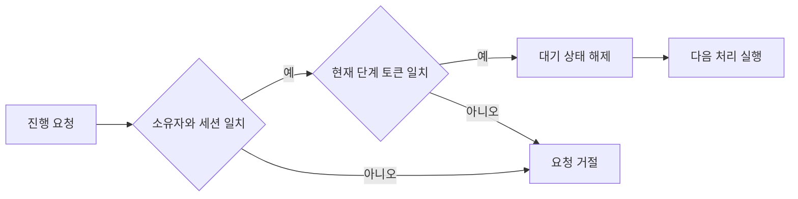

# NPC 상호작용의 요청 검증

## Issue

대화와 선택지, 미니게임이 이어지는 동안 중복 입력이나 늦게 도착한 요청이 현재 단계에 그대로 적용되면, 동일한 단계를 반복 진행하거나 잘못된 시점에 결과를 반영할 수 있습니다. 이러한 실패 조건을 고려해 입력 요청과 실제 상태 변경의 경계를 서버에서 관리하도록 했습니다.

## Solution

서버가 요청자, 맵, 진행 조건과 현재 세션 소유자를 검증하도록 했습니다. 시작 요청에는 중복 확인용 요청 ID를 사용하고, 진행 요청에는 세션 ID와 단계 토큰을 전달하도록 했습니다. 단계 토큰은 현재 대화 단계를 식별하는 값으로, 지난 단계에서 만들어진 요청이 새 단계를 진행시키지 못하게 하는 기준입니다.

유효한 진행 요청은 대기 상태를 먼저 변경한 뒤 처리하도록 하여 같은 단계의 재진입을 막았습니다. 시작 실패는 실제 이벤트가 실행되기 전인지 구분하고, 첫 실행 전 내부 오류에 대해서만 소모 자원을 복구하도록 했습니다.

## Result

중복 시작 요청과 현재 단계에 속하지 않는 진행 요청이 상태 변경으로 이어지지 않도록 검증 경계를 두었습니다. 실패 시에도 무조건 보상하는 대신 실행 전후를 구분하도록 했습니다.

현재 NPC 이벤트 관리자는 하나의 활성 세션을 관리하는 구조입니다. 여러 사용자의 NPC 이벤트를 동시에 처리하는 구조로 설명하지 않습니다. 또한 이 소스의 검증 분기를 실제 지연과 재전송 조건에서 확인하는 테스트 기록은 별도 실행 증거가 필요합니다.

[전체 검증 흐름: NpcEventManager](../Source/RootDesk/MyDesk/Event/NpcEventManager.mlua)
